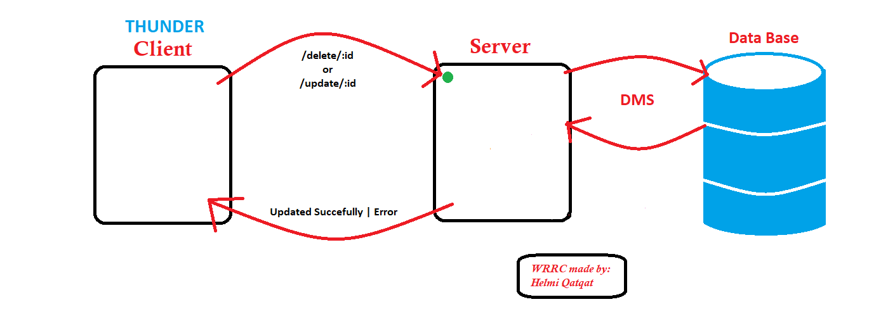

# Movies-Library - 1.0v

**Author Name**: Helmi Qatqat

## WRRC

## Overview

This Website contains the all the movies from all over the world translated to 4 languages.

## Getting Started
<!-- What are the steps that a user must take in order to build this app on their own machine and get it running? -->
1. Build a server that handles the requests of movies.
2. Have a database for movies data
3. Use frontend library 'React' to handle the UI.

## Project Features
<!-- What are the features included in you app -->
1. User Accout.
2. Ability to make a favorite list of movies.
3. Watch Movies in different resolutions and different subtitle languages.
